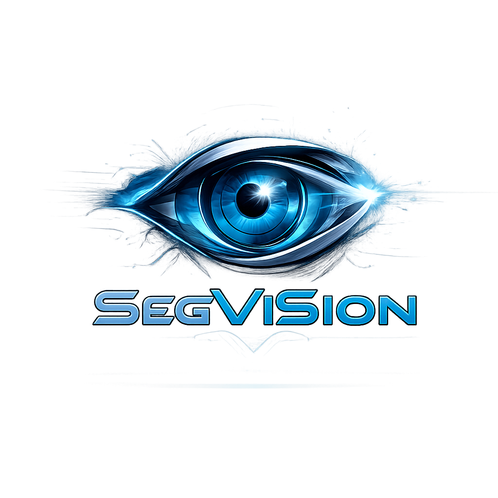

<div align="center">
  
</div>

<div align="center">

# SegViSion

### PSO-Powered Image Segmentation Web App

[](https://python.org)
[](https://flask.palletsprojects.com)
[](https://numpy.org)
[](https://opencv.org)
[](LICENSE)

<br/>

<a href="https://segvision.up.railway.app">
  
</a>

<br/>

> Segment any image into meaningful color regions using a **custom-built Particle Swarm Optimization** engine — no deep learning required. Real-time progress, side-by-side comparison, and instant download.

</div>

---

## ✨ Features

| Feature | Description |
|---|---|
| 🐝 **Swarm Intelligence** | PSO optimizes cluster centroids globally — escapes local minima K-Means can't |
| 🎨 **Color & Grayscale** | Supports both RGB color and grayscale segmentation modes |
| ⚡ **Real-Time Progress** | Live SSE stream shows iteration count and MSE cost as PSO runs |
| 🖼️ **Side-by-Side Compare** | Visual comparison of original vs. segmented output |
| 📥 **One-Click Download** | Download the segmented image directly from the result page |
| 🌙 **Dark Glassmorphism UI** | Premium dark-mode interface with smooth animations and frosted-glass navbar |
| 📱 **Fully Responsive** | Works on desktop, tablet, and mobile |

---

## 🧠 How It Works

Pixels are encoded as **5D feature vectors** `[R, G, B, x_norm, y_norm]` — combining color with spatial position so segments are perceptually coherent, not just color-scattered.

```
Upload Image
    │
    ▼
Build Spatial Feature Vectors [R, G, B, X, Y]
    │
    ▼
PSO Swarm Optimization  ◄──  KMeans++ warm-start seed
    │   (minimize MSE fitness across particles)
    ▼
Converged Centroids
    │
    ▼
Assign every pixel → nearest centroid (full resolution)
    │
    ▼
Segmented Output Image
```

**PSO Velocity Update:**
```
v(t+1) = w·v(t) + c1·r1·(pbest − x) + c2·r2·(gbest − x)
```
- `w = 0.5` (decaying inertia) · `c1 = c2 = 1.5` · Early stop after 8 no-improve iterations

---

## 🏗️ Project Structure

```
pso-image-main/
├── app.py                  Flask app — routing, SSE streaming, thread management
├── pso_engine.py           Core PSO algorithm + spatial feature engineering
├── requirements.txt        Python dependencies
├── static/
│   ├── css/style.css       Token-based CSS design system (dark theme)
│   ├── js/app.js           Drag-drop, EventSource progress, SVG ring UI
│   ├── favicon.png/ico     Browser tab icon
│   └── logo.png            Navbar brand logo
└── templates/
    ├── index.html          Upload & segmentation page
    └── result.html         Side-by-side result + download page
```

---

## 🚀 Quick Start

```bash
# Clone the repository
git clone https://github.com/sanyam-katoch10/pso-image-main.git
cd pso-image-main

# Install dependencies
pip install -r requirements.txt

# Run the app
python app.py
```

Open [http://localhost:5000](http://localhost:5000) in your browser.

**Usage:**
1. Drag & drop an image or click to browse
2. Set number of segments (2–10) and color mode
3. Click **Run Segmentation** — watch real-time PSO progress
4. Compare original vs. segmented side-by-side
5. Download the result

---

## 🛠️ Tech Stack

| Layer | Technology |
|---|---|
| **Backend** | Python 3, Flask, threading, queue |
| **ML Engine** | Custom PSO + KMeans++ (NumPy, scikit-learn) |
| **Image Processing** | OpenCV, Pillow |
| **Frontend** | HTML5, Vanilla CSS3, JavaScript ES6+ |
| **Real-Time** | Server-Sent Events (SSE) — `text/event-stream` |

---

## ⚙️ Architecture Highlights

- **Non-blocking API** — segmentation runs in a daemon thread; `/segment` returns `job_id` instantly
- **SSE streaming** — `/progress/<job_id>` pushes JSON frames per PSO iteration (same pattern as ChatGPT token streaming)
- **Auto cleanup** — uploaded and result files auto-delete 120s after completion
- **Spatial clustering** — `(X, Y)` coords in feature space prevent scattered, perceptually meaningless segments

---

## 📄 License

All rights reserved © [Sanyam Katoch](https://github.com/sanyam-katoch10)

---

<div align="center">
  Built by <a href="https://github.com/sanyam-katoch10"><strong>Sanyam Katoch</strong></a>
  &nbsp;·&nbsp;
  <a href="https://segvision.onrender.com">🚀 Live Demo</a>
</div>
